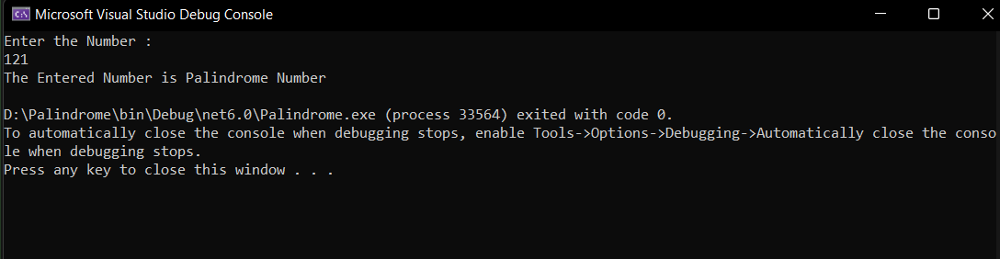

# Palindrome


## Aim:
To write a C# program to find whether the given string is a Palindrome or not.
# Algorithm:
## Step 1:
To start the C# program in visual Studio 2022.

## Step 2:
Create a class and declare two variable with string datatype.

## Step 3:
Loop over the entire string and reverse it.

## Step 4:
Use if condition to check whether the string and the reversed string is equal or not.

## Step 5:
print palindrome if it's equal else print not a palindrome.

## Step 6:
Save the program and run the program in visual studio 2022.

## Program:
```
using System;

namespace ConsoleApp1
{
    class Program
    {

        static void Main(string[] args)
        {
            int n,temp,rem,rev=0;
            Console.WriteLine("Enter the Number : ");
            n = Convert.ToInt32(Console.ReadLine());
            temp = n;
            while(n!=0)
            {
                rem = n % 10;
                rev = rev * 10 + rem;
                n = n / 10;
            }
            if(temp==rev)
            {
               Console.WriteLine("The Entered Number is Palindrome Number");
            }
            else
            {
                Console.WriteLine("The Entered Number is not a Palindrome Number");
            }
        }
    }
}

```
## Output:

## Result:
Thus the C# program to display whether the given string is Palindrome or not is executed successfully.
